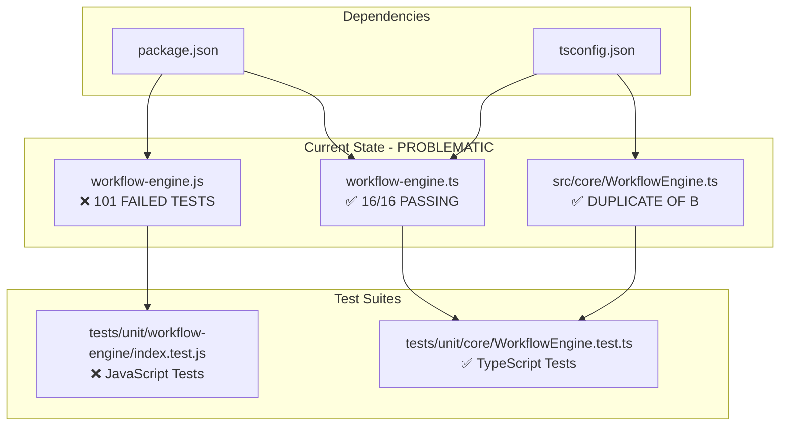

# 🏛️ ARCHITECT ANALYSIS - Dual Engine Problem

## 📊 CURRENT ARCHITECTURE STATE

### 🚨 CRITICAL ISSUE: DUAL WORKFLOWENGINE IMPLEMENTATIONS

```
src/
├── workflow-engine.js     ❌ JavaScript Engine (101 failing tests)
├── workflow-engine.ts     ✅ TypeScript Engine (16/16 passing tests)
└── core/
    └── WorkflowEngine.ts  ✅ TypeScript Engine (same as above)
```

## 🔍 MODULE INTERACTION DIAGRAM



## 🎯 ARCHITECT RECOMMENDATION

### **OPTION 1: CONSOLIDATE TO TYPESCRIPT ONLY** ⭐ RECOMMENDED
```
src/
├── core/
│   └── WorkflowEngine.ts  ✅ SINGLE SOURCE OF TRUTH
├── types/
│   └── index.ts          ✅ TYPE DEFINITIONS
└── utils/
    └── cancellableDelay.ts
```

**Benefits:**
- ✅ Single engine to maintain
- ✅ Type safety
- ✅ 16/16 tests already passing
- ✅ Modern TypeScript tooling

### **OPTION 2: ALIGN JAVASCRIPT WITH TYPESCRIPT**
```
src/
├── workflow-engine.js     ✅ ALIGNED WITH TS
├── workflow-engine.ts     ✅ TYPESCRIPT VERSION
└── core/
    └── WorkflowEngine.ts  ✅ MAIN IMPLEMENTATION
```

**Benefits:**
- ✅ Backward compatibility
- ✅ Both test suites pass
- ❌ Double maintenance burden

### **OPTION 3: MIGRATE ALL TO TYPESCRIPT**
```
src/
├── core/
│   └── WorkflowEngine.ts  ✅ ONLY ENGINE
├── types/
│   └── index.ts          ✅ TYPE DEFINITIONS
├── utils/
│   └── *.ts              ✅ ALL UTILITIES
tests/
├── unit/
│   └── core/
│       └── WorkflowEngine.test.ts  ✅ CONSOLIDATED TESTS
```

## 🔧 INTERFACE CONTRACTS

### **WorkflowEngine API (TypeScript Standard)**
```typescript
class WorkflowEngine extends EventEmitter {
  constructor(io: any, config?: WorkflowConfig | null)
  
  // Core Methods
  executeWorkflow(workflowData: Omit<Workflow, 'status' | 'endTime' | 'duration'>): Promise<string>
  cancelWorkflow(workflowId: string): boolean
  getWorkflow(workflowId: string): Workflow | undefined
  
  // Metrics & History
  getMetrics(): Metrics
  getWorkflowHistory(): Workflow[]
  getRunningWorkflows(): Workflow[]
}
```

### **Missing JavaScript Methods (Need Implementation)**
```javascript
// These methods exist in TypeScript but missing in JavaScript
- stopWorkflow(workflowId)
- updateMetrics(workflow)
- addToHistory(workflow)
- processQueue()
```

## 📋 IMPLEMENTATION PLAN

### **PHASE 1: ARCHITECTURAL DECISION**
- [ ] Choose consolidation strategy (RECOMMEND: Option 1)
- [ ] Update package.json scripts
- [ ] Modify tsconfig.json

### **PHASE 2: CODE ALIGNMENT**
- [ ] Remove duplicate engines
- [ ] Align JavaScript API with TypeScript
- [ ] Update import statements

### **PHASE 3: TEST CONSOLIDATION**
- [ ] Merge test suites
- [ ] Fix 101 failing JavaScript tests
- [ ] Ensure 100% test pass rate

### **PHASE 4: CLEANUP**
- [ ] Remove unused files
- [ ] Update documentation
- [ ] Verify CI pipeline

## 🚨 IMMEDIATE ACTIONS REQUIRED

1. **DECIDE**: Which consolidation strategy?
2. **ALIGN**: Fix JavaScript engine API mismatches
3. **CONSOLIDATE**: Remove duplicate implementations
4. **TEST**: Ensure all tests pass

## 📊 SUCCESS METRICS

- ✅ 0 failing tests
- ✅ Single WorkflowEngine implementation
- ✅ 100% TypeScript compliance
- ✅ Updated documentation
- ✅ CI green

---

**🏛️ ARCHITECT COMPLETE - HANDING OFF TO MECHANIC**
